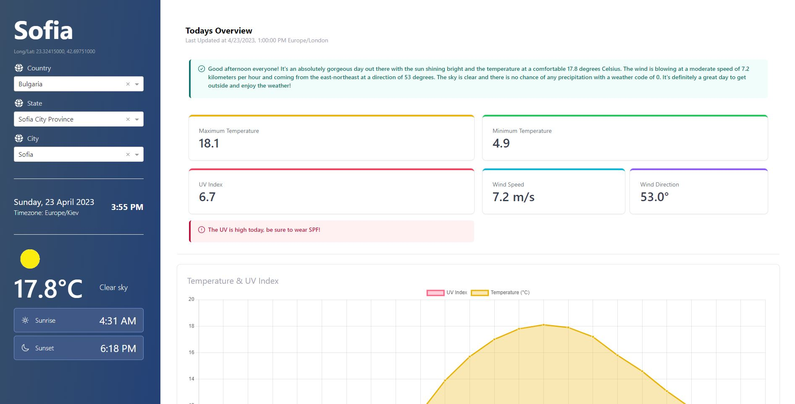

<h1 align="center">
  
  <br />
  WeatherGPT
  <br />
</h1>

<h4 align="center">
   WeatherGPT is weather forecast application build with Angular and Django. It uses the Open Meteo API to get the weather forecast data and the GPT-3 API to generate the weather forecast summary.
</h4>

<p align="center">
   
   
</p>

<p align="center">
  <a href="#key-features">Key Features</a> •
  <a href="#key-technologies">Key Technologies</a> •
  <a href="#requirements">Requirements</a> •
  <a href="#docker-setup">Docker Setup</a> •
  <a href="#local-setup">Local Setup</a> •
  <a href="#support">Support</a> •
  <a href="#license">License</a>
</p>



## Key Features

- Weather forecast based on location
- Weather forecast summary generated by GPT-3
- ChartJS weather forecast visualization
- Responsive design

---

## Key Technologies

- Angular
- Django
- GPT-3
- Open Meteo API
- ChartJS
- TailwindCSS
- TypeScript
- Docker

---

## Requirements

- Dockeror (if running with Docker)
- Python
- Node.js

## Docker Setup

1. Clone the repository:

```bash
git clone https://github.com/MartsTech/WeatherGPT.git
```

2. Navigate to the project directory:

```bash
cd WeatherGPT
```

3. Set up environment variables for the `frontend`. Navigate to the [environments](./frontend/src/environments/) and then open the environment files and fill in the required variables.

4. Set up environment variables for the `backend`. Navigate to the [.env.example](./backend/.env.example) file and copy it to a new file called `.env` and fill in the required variables.

5. Start the project using Docker Compose:

```bash
docker-compose up --build
```

6. Navigate to `http://localhost:4200` to see the `frontend` running and `http://localhost:8000` to see the `backend`.

---

## Local Setup

1. Clone the repository:

```bash
git clone https://github.com/MartsTech/WeatherGPT.git
```

2. Navigate to the project directory:

```bash
cd WeatherGPT
```

3. Set up environment variables for the `frontend`. Navigate to the [environments](./frontend/src/environments/) and then open the environment files and fill in the required variables.

4. Set up environment variables for the `backend`. Navigate to the [.env.example](./backend/.env.example) file and copy it to a new file called `.env` and fill in the required variables.

5. Install the frontend dependencies and start the development server (if you don't have `pnpm` installed, you can install it with `npm install -g pnpm` or use `npm` or `yarn` instead of `pnpm`):

```bash
cd frontend
pnpm install
pnpm start
```

6. Install the backend dependencies and start the development server:

```bash
cd backend
pip install -r requirements.txt
python manage.py runserver
```

7. Navigate to `http://localhost:4200` to see the `frontend` running and `http://localhost:8000` to see the `backend`.

---

## Support

Whether you use this project, have learned something from it, or just like it, please consider supporting it by buying me a coffee, so I can dedicate more time on open-source projects like this :)

<a href="https://www.buymeacoffee.com/martstech" target="_blank">
  
</a>

---

## License

> You can check out the full license [here](https://github.com/MartsTech/WeatherGPT/blob/main/LICENSE)

This project is licensed under the terms of the **MIT** license
